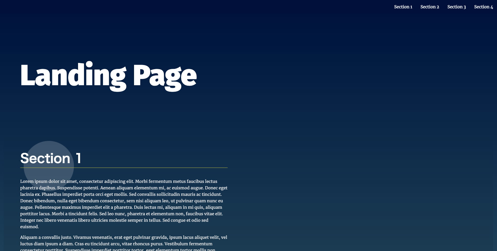
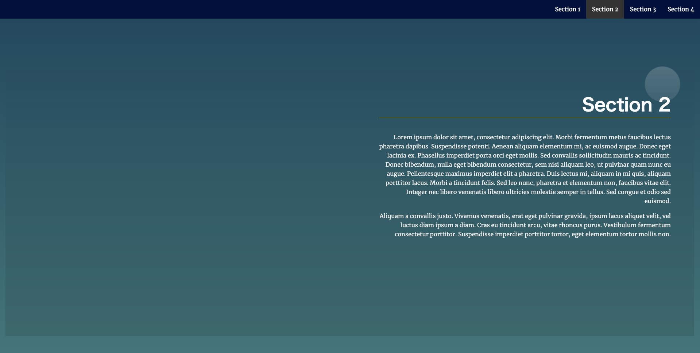

# Landing Page Project
This is the 2nd project of Front End Web Developer Nanodegree Program at Udacity ([[program page]](https://www.udacity.com/course/front-end-web-developer-nanodegree--nd0011)).

## Overview
Adding to the starter codes [here](https://github.com/udacity/fend/tree/refresh-2019/projects/landing-page), this project has several features:
- It has navigation bar at the top of the page.
- Clicking a button in the navigation bar makes a scroll to each section.
- While scrolling the page, the section being viewed is highlightened.

